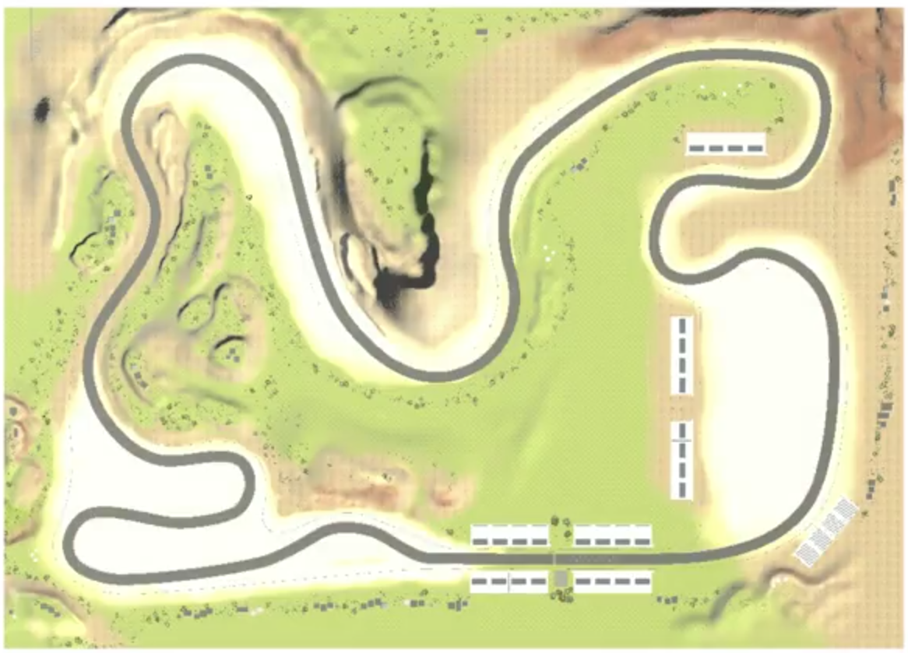
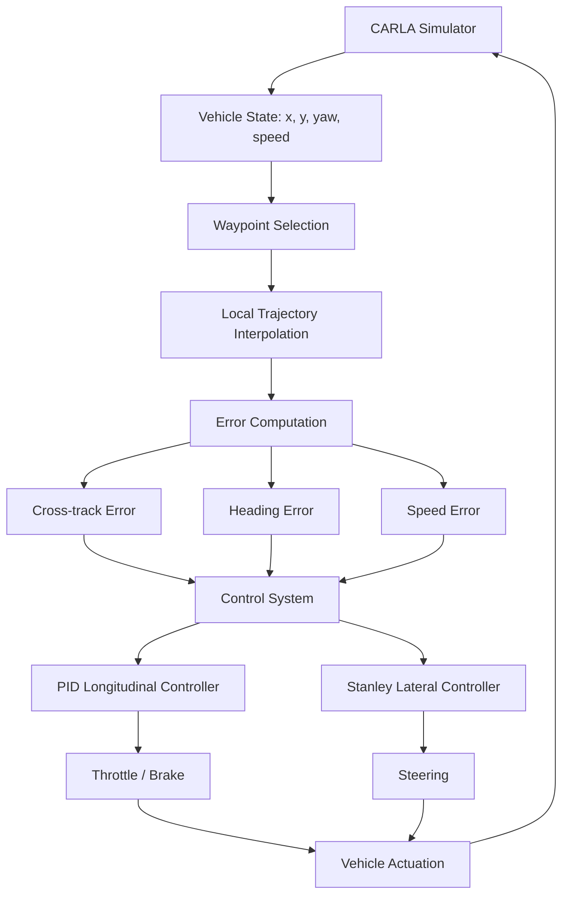
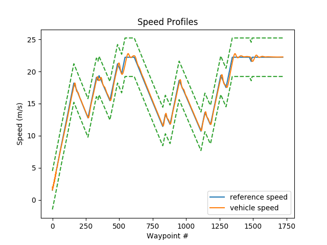
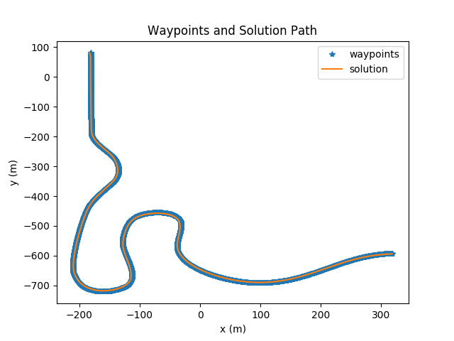

⭐ **1. Introduction**

Modern autonomous driving systems require robust trajectory tracking and control to follow planned routes accurately in simulation environments like CARLA.

This project implements an end-to-end waypoint tracking controller that enables a simulated vehicle to follow a predefined path using classical control methods. It combines longitudinal speed control and lateral steering control into a unified closed-loop system.

🎥 Simulation Environment Demo - Race Track

<table>
  <tr>
    <td align="center">
      <b>Main Straight </b> 
      
    </td>
    <td align="center">
      <b>Corners </b> 
      
    </td>
  </tr>
</table>

---

🧩 **2. Challenge**

This project addresses the challenges of real-time trajectory tracking and vehicle control in a simulated autonomous driving environment using CARLA.

The vehicle is evaluated on a predefined test track represented as a sorted sequence of waypoints. These waypoints are uniformly spaced along the track and serve as the reference trajectory for the controller. Each waypoint contains both position (x, y) and target speed, meaning the reference signal defines both where the vehicle should go and how fast it should travel.

Key challenges include:

- Maintaining stable path tracking under continuously changing vehicle states (speed, yaw, position).  
- Handling discretized waypoint inputs that introduce noise and discontinuities in the reference trajectory.  
- Balancing longitudinal speed control with lateral steering control in a closed-loop system.  
- Ensuring numerical stability in PID control and robustness of steering at low speeds.

<table>
  <tr>
    <td align="center">
      <b>Full Test Track </b> 
      
    </td>
  </tr>
</table>

---

🎯 **3. Objectives**

This project focuses on building a robust waypoint tracking controller for autonomous vehicle simulation in CARLA.

Key objectives include:

- Develop a longitudinal control system for accurate speed tracking using PID control.  
- Design a lateral control system for stable path following using Stanley steering control.  
- Enable simultaneous position and velocity tracking using a unified closed-loop controller.  
- Convert reference waypoints into actionable vehicle commands (throttle, brake, steering).  

---

🛠 **4. Tech Stack**

This project is implemented using a simulation-based autonomous driving and controls stack.

Key technologies include:

- CARLA Simulator – autonomous driving simulation environment  
- Python – core implementation of control logic and simulation interface  
- NumPy – numerical computations for control and trajectory processing  
- Matplotlib – real-time trajectory and control signal visualization  
- PID Control Framework – longitudinal speed control implementation  
- Stanley Controller – lateral path tracking control method  

---

🚀 **5. System Architecture - Simplified Overview**

---

🧠 **6. Key Concepts**

**PID Control (Longitudinal Control)**  
Used to regulate vehicle speed by minimizing the error between desired and actual velocity using proportional, integral, and derivative terms.

**Stanley Controller (Lateral Control)**  
A geometric path-tracking controller that computes steering based on heading error and cross-track error to minimize deviation from the reference trajectory.

**Cross-Track Error**  
The perpendicular distance between the vehicle’s current position and the closest point on the reference path.

**Heading Error**  
The angular difference between the vehicle’s orientation and the tangent direction of the reference trajectory.

**Speed Error**  
The difference between the target waypoint speed and the current vehicle speed, used in longitudinal PID control.

---

📈 **7. Simulation Results**

*Longitudinal Speed Tracking*

The longitudinal controller uses a PID loop on the speed error \( v_{desired} - v \), where the desired speed is selected from the nearest waypoint. The control output is passed through a tanh-based mapping and rate limiting to ensure smooth throttle commands and stable convergence across varying speed profiles. This results in stable convergence to the reference speed profile across varying waypoint velocities.

<table>
  <tr>
    <td align="center">
      <b>Longitudinal Control </b> 
      
    </td>
  </tr>
</table>

*Lateral Path Tracking*

The lateral controller implements a Stanley-style approach combining heading error from the waypoint direction with a speed-scaled cross-track correction term. The final steering command is normalized and saturated to remain within vehicle limits, enabling stable tracking along both straight and curved sections.

<table>
  <tr>
    <td align="center">
      <b>Lateral Control </b> 
      
    </td>
  </tr>
</table>

The controller outputs throttle, brake and steering commands that directly translate the computed longitudinal and lateral control signals into vehicle actuation. The corresponding plots and data files for these control signals can be found in the project folder within the repository.

---

🧭 **8. Future Extensions**

Potential next-stage improvements for this project include:

- Integration of perception modules (camera/LiDAR) for waypoint-free navigation.  
- Advanced control methods such as MPC (Model Predictive Control) for improved trajectory tracking.  
- Adaptive tuning of PID gains based on vehicle speed and curvature conditions.  
- Extension to dynamic environments with moving vehicles and pedestrians in CARLA.  

---

⚠️ **9. Data Note**

This project is developed as part of the Self-Driving Cars Specialization from the University of Toronto and is intended for demonstration purposes.

It uses open-source simulation tools and publicly available waypoint-based test scenarios within the CARLA simulator.

No proprietary data is used in this repository.

---

👨‍💻 **10. Key Takeaways / Skills Demonstrated**

This project demonstrates end-to-end implementation of a closed-loop autonomous vehicle control system in a simulated environment using CARLA.

Key skills showcased include:

- Design and implementation of real-time feedback control systems  
- Application of PID control for longitudinal speed regulation  
- Implementation of Stanley controller for lateral path tracking  
- Error formulation for cross-track, heading, and speed control  
- Integration of control logic within a simulation loop with real-time updates  

